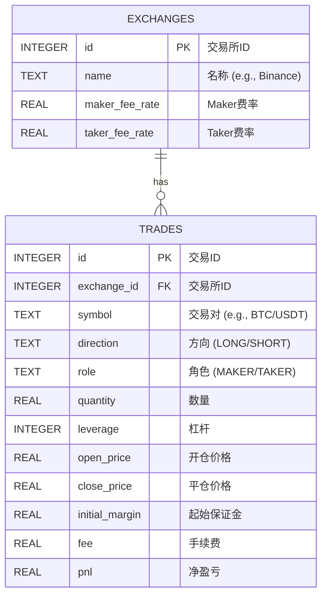

# 虚拟货币合约交易记录 SQLite 数据库设计方案

一个用于记录和分析虚拟货币合约交易的 SQLite 数据库。

### 数据库表结构 (Database Table Structure)

#### 1. 交易所表 (`exchanges`)

此表用于存储交易所的基本信息，每个交易所作为一条独立的记录。

| 字段名 (Field Name) | 数据类型 (Data Type) | 约束/备注 (Constraints/Notes)                          |
| :------------------ | :------------------- | :----------------------------------------------------- |
| `id`                | `INTEGER`            | 主键, 自增 (Primary Key, Auto-increment)               |
| `name`              | `TEXT`               | `NOT NULL`, `UNIQUE` (交易所名称，如 'Binance', 'OKX') |
| `maker_fee_rate`    | `REAL`               | `NOT NULL` (Maker 手续费率，例如: 0.0002)              |
| `taker_fee_rate`    | `REAL`               | `NOT NULL` (Taker 手续费率，例如: 0.0005)              |

#### 2. 交易记录表 (`trades`)

此表是核心，用于记录每一笔完整的合约交易。

| 字段名 (Field Name) | 数据类型 (Data Type) | 约束/备注 (Constraints/Notes)                            |
| :------------------ | :------------------- | :------------------------------------------------------- |
| `id`                | `INTEGER`            | 主键, 自增 (Primary Key, Auto-increment)                 |
| `exchange_id`       | `INTEGER`            | `NOT NULL`, 外键, 关联 `exchanges.id` (Foreign Key)      |
| `symbol`            | `TEXT`               | `NOT NULL` (交易对, 如 'BTC/USDT')                       |
| `direction`         | `TEXT`               | `NOT NULL` (交易方向, 'LONG' 或 'SHORT')                 |
| `role`              | `TEXT`               | `NOT NULL` (订单角色, 'MAKER' 或 'TAKER')                |
| `quantity`          | `REAL`               | `NOT NULL` (成交数量, 基础货币单位, 如 0.5 个 BTC)       |
| `leverage`          | `INTEGER`            | `NOT NULL` (杠杆倍数, 如 20)                             |
| `open_price`        | `REAL`               | `NOT NULL` (开仓价格, USDT/基础货币)                     |
| `close_price`       | `REAL`               | `NOT NULL` (平仓价格, USDT/基础货币)                     |
| `initial_margin`    | `REAL`               | `NOT NULL` (起始保证金, USDT)                            |
| `fee`               | `REAL`               | `NOT NULL` (总手续费, USDT, 根据 role 和交易所费率计算)  |
| `pnl`               | `REAL`               | `NOT NULL` (净盈亏, USDT, Profit and Loss)               |
| `open_timestamp`    | `TEXT`               | `NOT NULL` (开仓时间, ISO 8601 格式，但只需要精确到日期) |
| `close_timestamp`   | `TEXT`               | `NOT NULL` (平仓时间, ISO 8601 格式，但只需要精确到日期) |
| `notes`             | `TEXT`               | 可选, 用于记录额外信息 (Optional notes)                  |

---

### 关系图 (ER Diagram)

使用 Mermaid 绘制的实体关系图如下，清晰地展示了表之间的关系。

---

### 核心计算公式 (Core Calculation Formulas)

在向 `trades` 表中插入数据时，应根据以下公式计算 `fee` 和 `pnl` 字段的值。

#### 单位规范
*   **价格 (Price)**: USDT / 基础货币 (例如 `USDT/BTC` 币对，这里/不是表示除法)
*   **数量 (Quantity)**: 基础货币 (例如 `BTC` 的数量)
*   **保证金/手续费/盈亏**: USDT
*   **杠杆**: 无单位
*   **费率**: 无单位 (小数表示, 如 0.02%)

#### 1. 起始保证金 (Initial Margin)
此公式验证了 "起始保证金 * 杠杆 = 名义价值" 这一关系。

$$
\text{初始保证金 (USDT)} = \frac{\text{成交数量 (基础货币)} \times \text{开仓价格 (USDT/基础货币)}}{\text{杠杆倍数}}
$$

#### 2. 手续费 (Fee)
手续费基于开仓时的名义价值计算。费率根据该笔订单是 `MAKER` 还是 `TAKER` 从关联的交易所信息中获取。

$$
\text{手续费 (USDT)} = \text{成交数量 (基础货币)} \times \text{开仓价格 (USDT/基础货币)} \times \text{手续费率}
$$

*注：`手续费率` 取决于 `trades.role` 字段的值，对应 `exchanges` 表中的 `maker_fee_rate` 或 `taker_fee_rate`。*

#### 3. 净盈亏 (PNL - Profit and Loss)

**做多 (LONG):**
$$
\text{净盈亏 (USDT)} = (\text{平仓价格} - \text{开仓价格}) \times \text{成交数量} - \text{手续费}
$$

**做空 (SHORT):**
$$
\text{净盈亏 (USDT)} = (\text{开仓价格} - \text{平仓价格}) \times \text{成交数量} - \text{手续费}
$$

---

### 数据查询与统计 (Data Query & Statistics)

#### 1. 计算单个交易所的总盈亏
要实现此需求，只需对 `trades` 表中的 `pnl` 字段求和，并按 `exchange_id` 分组。

**计算逻辑:**
`SELECT SUM(pnl) FROM trades WHERE exchange_id = [指定交易所的ID]`

$$
\text{交易所总盈亏} = \sum_{i \in \text{该交易所的交易}} \text{pnl}_i
$$

#### 2. 计算所有交易的总盈亏
要实现此需求，只需对 `trades` 表中所有的 `pnl` 字段求和。

**计算逻辑:**
`SELECT SUM(pnl) FROM trades`

$$
\text{所有交易总盈亏} = \sum_{\text{所有交易}} \text{pnl}
$$

